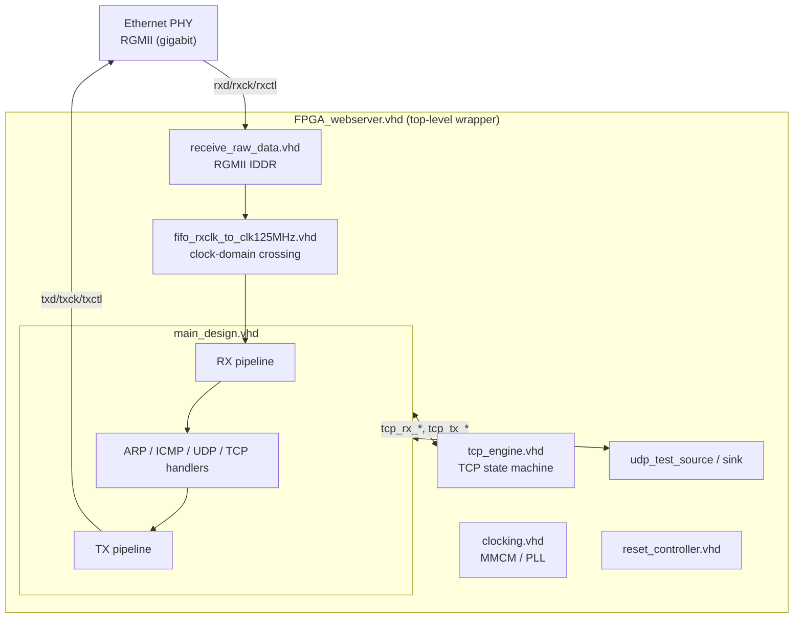
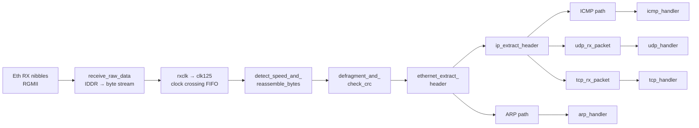
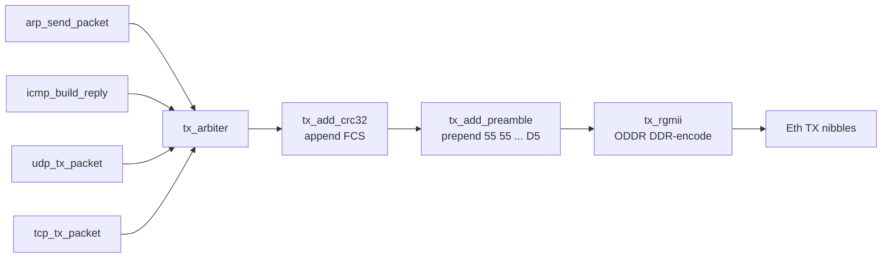
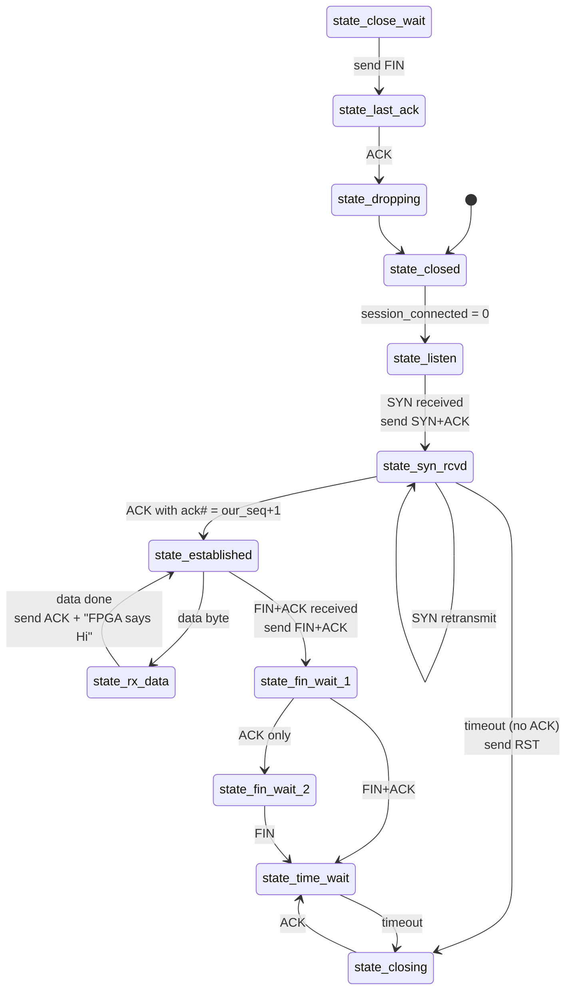
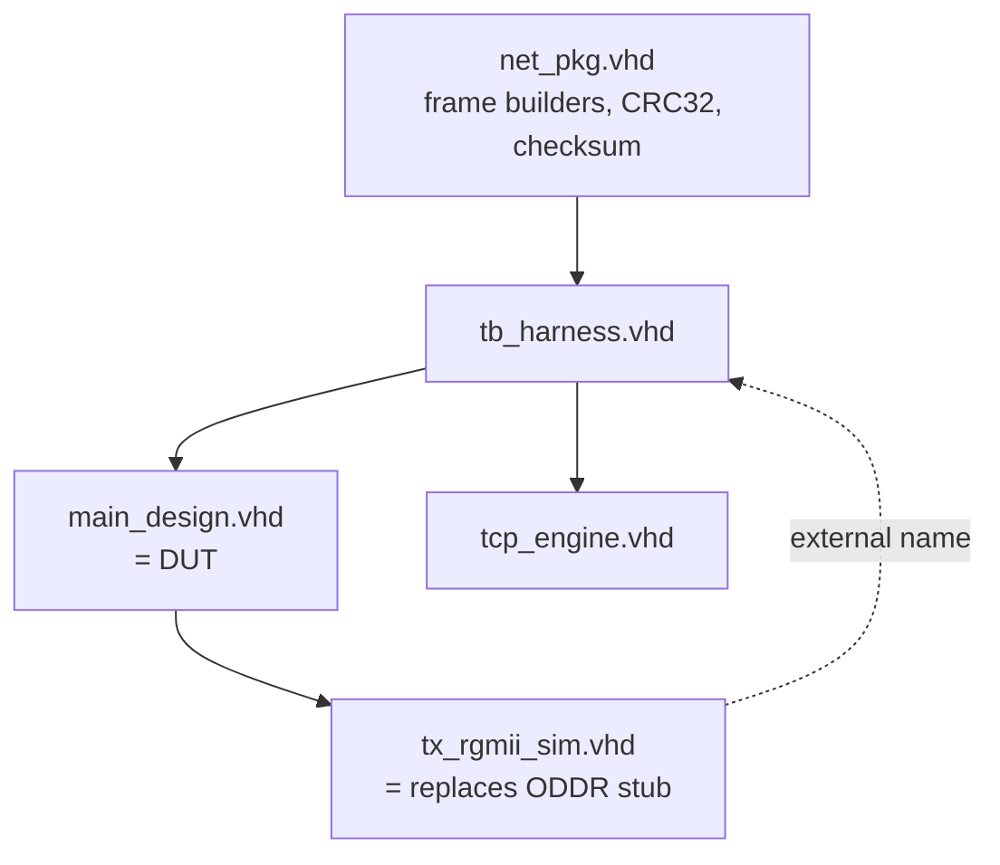

# FPGA Webserver — Design Document

## 1. What the project is

A **software-free** HTTP/TCP/UDP/ICMP/ARP server implemented entirely in VHDL. The FPGA itself is the network stack — there is no CPU, no firmware, no operating system. Frames arrive on the Ethernet PHY, get parsed by combinational+sequential logic, and the appropriate replies are constructed and emitted back out the PHY.

The original author (Mike Field, `hamsternz`) stopped in mid-2016 partway through the TCP close states. This fork picks up from there, adds a self-checking simulation harness, knocks out the RX-validation TODO list, and is working toward a functional HTTP layer and a port to a cheap open-toolchain FPGA board.

## 2. System hierarchy



The wrapper `FPGA_webserver.vhd` owns the PHY clock-domain crossing and instantiates the **TCP state machine** (`tcp_engine`) alongside `main_design`. **Important:** `tcp_engine` is *not* inside `main_design` — a testbench that only instantiates `main_design` has zero TCP state. Our harness instantiates `tcp_engine` explicitly.

## 3. RX pipeline (PHY → handlers)



| Stage | File | Role |
|---|---|---|
| RGMII deserializer | [hdl/receive_raw_data.vhd](hdl/receive_raw_data.vhd) | Xilinx IDDR turns DDR nibble pairs into bytes; runs in the PHY RX clock domain. |
| Clock crossing | [hdl/fifo_rxclk_to_clk125MHz.vhd](hdl/fifo_rxclk_to_clk125MHz.vhd) | Crosses bytes from PHY RX clock to the system 125 MHz. |
| Speed detect + byte assembly | [hdl/detect_speed_and_reassemble_bytes.vhd](hdl/detect_speed_and_reassemble_bytes.vhd) | Decodes idle symbols (`0xDD` etc.) to set `link_1000mb` / `link_100mb` / `link_10mb`; reassembles nibble pairs into bytes for 10/100M; emits a `data_enable` clock-enable. |
| Defragment + FCS | [hdl/defragment_and_check_crc.vhd](hdl/defragment_and_check_crc.vhd) | Ring-buffers received bytes, runs Ethernet CRC32, drops bad-FCS or wrong-MAC frames. |
| Ethernet header | [hdl/ethernet/ethernet_extract_header.vhd](hdl/ethernet/ethernet_extract_header.vhd) | Splits ARP (0x0806) from IPv4 (0x0800). |
| IP header | [hdl/ip/ip_extract_header.vhd](hdl/ip/ip_extract_header.vhd) | Parses IPv4 header, validates IP checksum, filters by `filter_protocol` (1=ICMP, 6=TCP, 17=UDP) and destination IP. |
| ARP / ICMP / UDP / TCP RX | various `*_rx_packet.vhd` / `*_handler.vhd` | Protocol-specific parsers. ARP feeds the ARP handler directly; ICMP/UDP/TCP each have their own header extractors after `ip_extract_header`. |

### Frame drop mechanism (defragment_and_check_crc)

The ring buffer keeps a `start_of_packet_addr` and `write_addr`. Bytes stream in; at end-of-packet (when `input_data_present` falls from 1 to 0) the module decides whether to **commit** (increment `complete_packets`, move past FCS) or **rollback** (`write_addr <= start_of_packet_addr`). The frame never becomes visible to downstream handlers if rolled back.

| Check | When | Rejection criterion |
|---|---|---|
| Ethernet FCS | running CRC32, evaluated at EOP | internal residue ≠ `0xDEBB20E3` |
| Destination MAC | first 6 bytes captured into a shift register | not equal to `our_mac` AND not equal to `FF:FF:FF:FF:FF:FF` |

## 4. TX pipeline (handlers → PHY)



`tx_arbiter` is a request/grant arbiter: each of ARP/ICMP/UDP/TCP asserts `request`, the arbiter picks one, asserts `granted`, and streams the bytes through. Order: data first, then CRC append, then preamble prepend, then DDR-encode for the PHY.

## 5. TCP state machine

Lives in [hdl/tcp_engine/tcp_engine.vhd](hdl/tcp_engine/tcp_engine.vhd). Implemented as a 13-state FSM driven by the parsed RX fields and emitting TX requests through `tcp_engine_tx_fifo`.



`status[3:0]` of `tcp_engine` encodes the current state (1=dropping, 2=closed, 3=listen, 4=syn_rcvd, 5=syn_sent, 6=established, 7=rx_data, 8=fin_wait_1, 9=fin_wait_2, A=closing, B=time_wait, C=close_wait, D=last_ack).

### What works today
- Three-way handshake: `state_listen → state_syn_rcvd → state_established` via SYN → SYN+ACK → ACK.
- Data reception in `state_rx_data` with running ACK number.
- Server response: `send_some_data` triggers a 16-byte payload (`"FPGA says \"Hi\"\r\n"`) from `tcp_engine_content_memory`.

### What's broken or unfinished
- After completing the handshake, sim throughput collapses in `state_established`. Likely a perpetually-true condition driving signal updates every cycle (see open issues).
- Passive-close path: `state_established` on FIN goes to `state_fin_wait_1` (active close), not to `state_close_wait` (passive close). Author's last commit was "Starting to get the socket Closing states to work."

## 6. Naming and storage conventions

These two conventions catch every reader the first time. Bake them into your mental model.

### 6.1 MAC / IP / netmask are stored byte-reversed

Documented in `Using the UDP interface.txt` but easy to miss. A constant like:

```vhdl
constant our_mac : std_logic_vector(47 downto 0) := x"AB_89_67_45_23_02";
```

actually means MAC address **02:23:45:67:89:AB** on the wire. The byte at the LSB end of the VHDL constant (`02`) is the first byte transmitted. Same goes for IP (`x"0A_00_00_0A"` = `10.0.0.10`) and netmask (`x"00_FF_FF_FF"` = `/24`).

| What you write | What it means on the wire |
|---|---|
| `our_mac = x"AB_89_67_45_23_02"` | MAC `02:23:45:67:89:AB` |
| `our_ip = x"0A_00_00_0A"` | IP `10.0.0.10` (palindromic — looks the same either way) |
| `our_netmask = x"00_FF_FF_FF"` | netmask `255.255.255.0` |

Inside the RX parsers, fields are stored in the same byte-reversed form so comparisons against the constants are direct.

### 6.2 Speed detection requires idle symbols *first*

`detect_speed_and_reassemble_bytes` does not enable the gigabit datapath until it sees a valid 1000Mb idle symbol — a byte with `input_data_present = 0` whose upper and lower nibbles match and whose low three bits are `101`. `0xDD` and `0x55` both qualify (full-duplex / half-duplex respectively).

Until that idle symbol arrives, `link_1000mb` stays low and every received frame is silently dropped. Anything driving the input interface must emit some idle bytes before any real frame. The harness emits 64 idle cycles after power-up before any scenario.

## 7. Simulation setup



| File | Role |
|---|---|
| [Makefile](Makefile) | GHDL build: `make analyze`, `make TB=tb_harness run`, `make TB=tb_harness wave` |
| [sim_models/net_pkg.vhd](sim_models/net_pkg.vhd) | `make_arp_request`, `make_icmp_echo`, `make_udp`, `make_tcp` builders; `ip_checksum`; `eth_crc32`; `attach_fcs`. Every helper emits frames with a valid Ethernet FCS. |
| [sim_models/tx_rgmii_sim.vhd](sim_models/tx_rgmii_sim.vhd) | Sim-only replacement for the Xilinx-UNISIM-using `tx_rgmii`. Exposes `tx_snoop_byte` / `tx_snoop_valid` that the harness reads via a VHDL-2008 external name. |
| [testbenches/tb_harness.vhd](testbenches/tb_harness.vhd) | Drives RX frames, captures TX frames, asserts on contents. |

### Harness mechanics

**Driving frames in** — `push_frame(bytes)` writes one byte per clock onto `input_data` while honoring the `input_read` handshake driven by `detect_speed_and_reassemble_bytes`. Switches `input_data_present` from 0 to 1 to mark frame start, back to 0 to mark end. Bookends each frame with idle bytes (`0xDD` with `present=0`) so the speed-detect FSM sees a clean idle gap.

**Capturing frames out** — a snoop process reads `tx_snoop_byte` and `tx_snoop_valid` *inside* the `tx_rgmii_sim` instance, via:

```vhdl
alias snoop_byte is
    <<signal .tb_harness.i_dut.i_tx_interface.i_tx_rgmii.tx_snoop_byte
      : std_logic_vector(7 downto 0)>>;
```

Bytes accumulate into `rx_frame_buf` while `snoop_valid='1'`; the falling edge bumps `rx_frame_count`. The stim process uses a `wait_for_reply(timeout_us)` helper that just polls for the counter incrementing.

## 8. Scenario coverage

All scenarios run end-to-end in `tb_harness.vhd`. Latest run prints `=== SUMMARY: 7 passed, 0 failed === ALL TESTS PASSED`.

| # | Scenario | What it proves |
|---|---|---|
| 1 | ARP request (broadcast) | RX → arp_handler → arp_send_packet → TX produces correct ARP reply with our_mac/our_ip |
| 2 | ICMP echo request | RX → ip_extract_header → icmp_handler → icmp_build_reply → TX produces ICMP type 0 (echo reply) |
| 3 | UDP packet | RX → ip_extract_header → udp_handler exposes ports + payload on `udp_rx_*` interface |
| 4 | TCP SYN to port 80 | RX → tcp_handler → tcp_engine → state_listen→state_syn_rcvd → TX produces SYN+ACK with `ack# = client_seq+1` |
| 5 | Bad FCS frame | defragment_and_check_crc rolls back; no TX response |
| 6 | Unicast to wrong MAC | MAC filter rolls back; no TX response |
| 7 | Bad IP header checksum | ip_extract_header holds `data_valid_out` low; no TX response |

Scenarios 5-7 are **negative tests** — they confirm the validation paths *drop* frames rather than passing them through.

## 9. Generic flags introduced for sim/synth control

These let one VHDL source serve both real-hardware synthesis and fast simulation:

| Module | Generic | Default | Purpose |
|---|---|---|---|
| `defragment_and_check_crc` | `check_crc` | `true` | Set false to disable FCS validation (useful if a testbench drives frames without a valid CRC). |
| `defragment_and_check_crc` | `filter_mac` | `true` | Set false to accept any destination MAC. |
| `defragment_and_check_crc` | `our_mac` | zeros | The board's MAC (byte-reversed form). |
| `ip_extract_header` | `check_checksum` | `true` | Set false to skip IP header checksum validation. |
| `tcp_engine` | `timeout_cycles` | `5*125_000_000` | Number of clock cycles for the SYN-RCVD timeout. Override to ~125 000 in sim so a 5-second decrement loop doesn't bog GHDL down. |

## 10. Repo layout

```text
FPGA_Webserver/
├── DESIGN.md                    ← this file
├── README.txt                   ← upstream status notes
├── Makefile                     ← GHDL build
├── constraints/nexys_video.xdc  ← original board pinout (Arty / Colorlight constraints TBD)
├── hdl/
│   ├── FPGA_webserver.vhd       ← TOP level for synthesis (instantiates clocking, main_design, tcp_engine)
│   ├── main_design.vhd          ← protocol stack body
│   ├── clocking.vhd             ← Xilinx MMCM (sim stub TBD per board)
│   ├── receive_raw_data.vhd     ← Xilinx IDDR
│   ├── defragment_and_check_crc.vhd
│   ├── detect_speed_and_reassemble_bytes.vhd
│   ├── fifo_rxclk_to_clk125MHz.vhd
│   ├── reset_controller.vhd
│   ├── arp/                     ← arp_handler, arp_send_packet, arp_tx_fifo, arp_request (= rx_arp), arp_resolver (broken upstream, excluded)
│   ├── icmp/                    ← icmp_handler, icmp_build_reply, icmp_extract_*
│   ├── ip/                      ← ip_extract_header, ip_add_header
│   ├── udp/                     ← udp_handler, udp_rx_packet, udp_tx_packet, udp_add_udp_header, udp_test_source, udp_test_sink
│   ├── tcp/                     ← tcp_handler, tcp_rx_packet, tcp_tx_packet, tcp_add_header, tcp_extract_header
│   ├── tcp_engine/              ← tcp_engine, session_filter, content_memory, seq_generator, tx_fifo, add_data
│   ├── ethernet/                ← ethernet_extract_header, ethernet_add_header
│   ├── transport/               ← transport_commit_buffer
│   ├── tx/                      ← tx_arbiter, tx_add_crc32, tx_add_preamble, tx_interface, tx_rgmii
│   └── other/                   ← fifo_32, buffer_count_and_checksum_data
├── testbenches/
│   ├── tb_harness.vhd           ← self-checking, the only one that asserts
│   ├── tb_main_design*.vhd      ← upstream wave-dump-only tbs
│   ├── tb_defragment_and_check_crc.vhd
│   ├── tb_tcp_engine_add_data.vhd
│   └── tb_FPGA_webserver.vhd
└── sim_models/
    ├── net_pkg.vhd              ← frame builders, CRC32, IP checksum
    └── tx_rgmii_sim.vhd         ← sim stub for the Xilinx ODDR-based tx_rgmii
```

## 11. Open issues / what's next

| ID | Phase | Description |
|---|---|---|
| `state_established` slowness | 3 | After SYN-ACK-ACK, GHDL throughput collapses. Suspect a perpetually-true condition driving signal updates every cycle. Needs targeted profiling. |
| HTTP layer | 4 | Replace the 16-byte `"FPGA says \"Hi\"\r\n"` payload in `tcp_engine_content_memory` with a proper HTTP/1.0 response (headers + minimal HTML). |
| Port to Colorlight 5A-75B | 5 | Replace `clocking.vhd`, `tx_rgmii.vhd`, `receive_raw_data.vhd` Xilinx primitives with ECP5 equivalents. Add a constraints file (LPF format for `nextpnr`). |
| TCP RX TCP-checksum validation | 2 leftovers | Compute checksum over pseudo-header + segment. |
| UDP RX UDP-checksum validation | 2 leftovers | Skip if received checksum is zero (legal in IPv4). |
| ICMP checksum + length validation | 2 leftovers | Add to `icmp_handler`. |
| UDP TX zero-data | 2 leftovers | Current API requires `udp_tx_valid` to be asserted at least one cycle with data; needs a separate "send-now" trigger. |
| 10/100Mbps TX | 2 leftovers | Per README: needs a 4k FIFO and arbiter back-pressure. |
| `arp_resolver.vhd` | cleanup | Half-written upstream — references undeclared signals, ports declared `in` but assigned to. Excluded from sim build; not in live hierarchy. Either finish it (for active-open ARP discovery) or delete. |

## 12. Building and running

### Simulation (GHDL)

```bash
# Compile everything
make analyze

# Run the self-checking harness
make TB=tb_harness run STOP=200us

# Run with waveform dump for gtkwave
make TB=tb_harness wave STOP=200us
```

The Makefile excludes `arp_resolver.vhd` (upstream-broken), `clocking.vhd`, `tx_rgmii.vhd`, `receive_raw_data.vhd`, and `FPGA_webserver.vhd` from the sim build because they depend on Xilinx UNISIM primitives. The sim build instead pulls in `sim_models/tx_rgmii_sim.vhd`.

### Synthesis (Xilinx — original target)

Open `FPGA_Webserver.xpr` in Vivado, set the top module to `FPGA_webserver`, and generate bitstream. The constraint file [constraints/nexys_video.xdc](constraints/nexys_video.xdc) targets the Nexys Video XC7A200T.

### Synthesis (Lattice ECP5 — Colorlight 5A-75B, planned)

Will need:

```bash
# Yosys for synthesis, nextpnr-ecp5 for place-and-route, prjtrellis for bitstream packing
yosys -p "synth_ecp5 -json out.json" hdl/*.vhd hdl/**/*.vhd
nextpnr-ecp5 --25k --package CABGA256 --json out.json --lpf colorlight_5a_75b.lpf --textcfg out.config
ecppack out.config out.bit

# Flash via openFPGALoader on the FT232H JTAG
openFPGALoader -c ft232 out.bit
```

VHDL support in yosys requires `ghdl-yosys-plugin`. The Xilinx-only modules (`clocking.vhd`, `tx_rgmii.vhd`, `receive_raw_data.vhd`) need ECP5-flavored rewrites (Lattice has `EHXPLLL` for the PLL and `ODDRX1F`/`IDDRX1F` for DDR I/O).

## 13. Performance numbers (current sim, GHDL mcode JIT)

| Sim time | Wall time | Throughput |
|---|---|---|
| 1 µs | ~0.6 s | ~1700× slower than realtime |
| 200 µs | ~2 min | ~8 000× slower than realtime |

Faster than icarus for this design size; cycle-accurate. For longer runs use the `--ieee-asserts=disable` flag (already in the Makefile) to suppress metavalue warnings that otherwise flood stderr from `NUMERIC_STD."/="`.

---

*This document tracks the current state of the fork. Update it as phases close out.*
